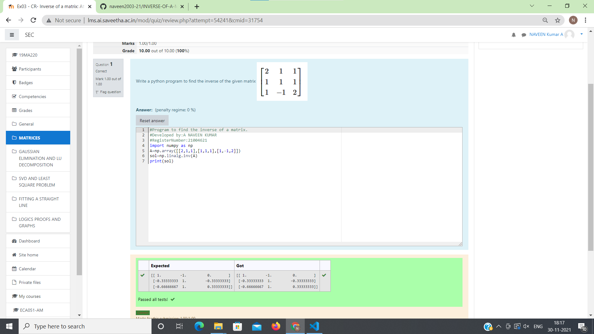

# INVERSE-OF-A-MATRIX
## Aim:
To write a python program to find the inverse of a matrix
## Equipment’s required:
1. 	Hardware – PCs
2. 	Anaconda – Python 3.7 Installation / Moodle-Code Runner
## Algorithm:
### Step1 : import numpy as np
### Step 2: prepare program for inverse matrix
### Step 3: using np.linalg.inv(), we can find the inverse of the given matrix.
### Step 4: to find inverse of matrix

## Program:
#Program to find the inverse of a matrix.

#Developed by:A NAVEEN KUMAR

#RegisterNumber:21004621

import numpy as np

A=np.array([[2,1,1],[1,1,1],[1,-1,2]])

sol=np.linalg.inv(A)

print(sol)
## Output:

## Result:
Thus the inverse of given matrix is successfully solved using python program

